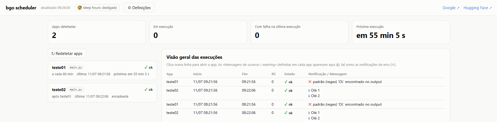
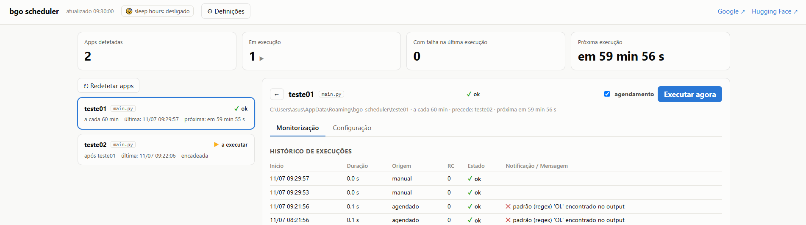
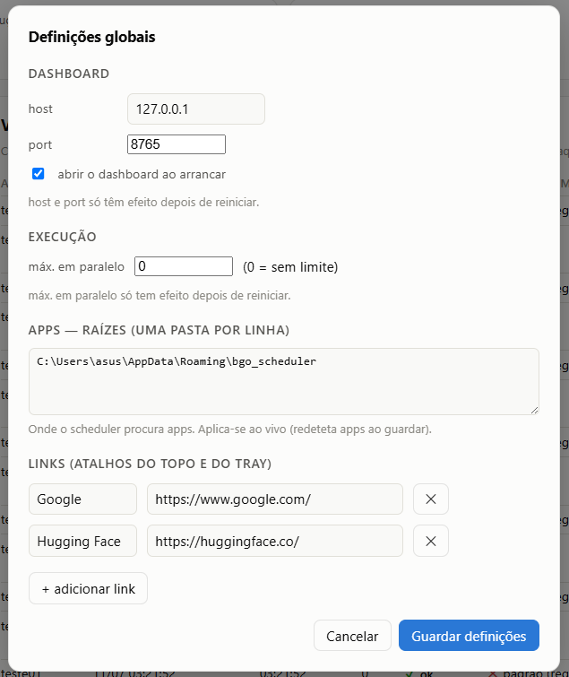
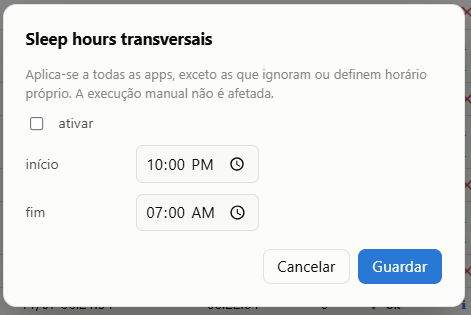

# bgo_scheduler

[](https://github.com/brunogoncalooliveira/bgo_scheduler/actions/workflows/ci.yml)
[](https://pypi.org/project/bgo-scheduler/)
[](https://pypi.org/project/bgo-scheduler/)
[](LICENSE)
[](https://github.com/astral-sh/ruff)

Scheduler de apps para Windows com ícone de system tray, dashboard web live e
logs em formato Grafana Loki. Distribuído como wheel Python.

📋 Histórico de alterações em [CHANGELOG.md](CHANGELOG.md).

## Objetivos

- **Scheduler Python de zero dependências** — o runtime não instala nada além
  da biblioteca padrão.
- **Avisos que tiram partido do Windows** — ícone de system tray (Win32 nativo)
  e notificações (toasts) para o estado das execuções.
- **Sleep hours transversais e específicas por app** — períodos em que o
  agendamento fica em pausa, definidos globalmente e/ou por aplicação.
- **Encadeamento de execuções** — uma app corre depois de outra terminar com
  sucesso (ex.: `app02` corre após `app01`).
- **Visão agregada e por app** — uma vista geral de todas as execuções e o
  detalhe/histórico de cada aplicação.

## Screenshots

**Visão geral de todas as apps** — indicadores no topo, lista de apps e o
histórico agregado com estado, RC, notificações e mensagens.



**Detalhe de uma app** — abas Monitorização / Configuração, histórico com
duração e origem, e "Executar agora".



**Definições globais** e **sleep hours transversais**, editáveis no dashboard:

<p>
  
  
</p>

## Instalação

```bat
pip install dist\bgo_scheduler-1.9.9-py3-none-any.whl
```

**Sem dependências de runtime**: o ícone de tray é nativo do Windows (Win32
via `ctypes`, carrega ficheiros `.ico`) e o dashboard usa só a stdlib.

Fica com dois comandos:

- `bgo-scheduler` — com consola (bom para debug); aceita `--headless` para
  correr sem ícone de tray (só scheduler + dashboard).
- `bgo-scheduler-tray` — sem janela de consola; é este que deves usar no
  arranque do Windows (atalho na pasta `shell:startup`).

Para reconstruir o wheel: `python -m pip wheel . --no-deps -w dist`.
Em desenvolvimento (sem instalar): `python systray_icon.py`.

## Estrutura de pastas e ficheiros

Há **duas zonas distintas**: a pasta de *configuração/dados* do scheduler e a(s)
pasta(s) de *apps*. Não têm de ser a mesma (embora no primeiro arranque
coincidam — ver "Configuração").

### Pasta de configuração/dados

Por omissão `%APPDATA%\bgo_scheduler` (ou onde apontar o `--config` /
`BGO_SCHEDULER_CONFIG`). É aqui que o scheduler guarda tudo o que produz:

```
%APPDATA%\bgo_scheduler\
├── scheduler.ini            ← configuração GLOBAL do scheduler
├── notification_rules.json  ← regras de notificação e mensagens
├── logs\                    ← logs JSON-lines (formato Grafana Loki)
│   ├── scheduler.log        ← log do próprio scheduler
│   ├── hello1.log           ← um ficheiro por app
│   └── hello2.log
└── history\                 ← histórico de execuções (persiste entre reinícios)
    ├── hello1.jsonl         ← uma linha JSON por execução
    └── hello2.jsonl
```

| Ficheiro / pasta | Para que serve |
|---|---|
| `scheduler.ini` | Configuração global: onde estão as apps (`[Apps] roots`), o dashboard (`host`/`port`), `max_parallel`, sleep hours transversais, atalhos `[Links]`. Parte é editável no dashboard (⚙ Definições), o resto à mão. |
| `notification_rules.json` | Padrões que disparam **notificações de erro** e **mensagens de sucesso/warning**. Gerido pelo dashboard (aba Configuração de cada app) — normalmente não se edita à mão. |
| `logs\<app>.log` | Um ficheiro por app; cada linha é um objeto JSON (`ts`, `level`, `app`, `event`, `msg`) pronto para o Grafana Loki. Escrito **à medida que a app corre**. Rotação automática 5 MB × 3. |
| `logs\scheduler.log` | Log do próprio scheduler: arranque, rescan, avisos de configuração, encadeamentos. |
| `history\<app>.jsonl` | Uma linha JSON por execução (início, fim, duração, código de saída, estado, origem, excerto do output, notificações). Carregado no arranque para o dashboard mostrar o histórico logo após reiniciar. Compactado acima de 2 MB. |

A pasta `logs\` pode ser movida com `[Logs] dir` no INI (ex.: para uma pasta que
o Promtail/Alloy já vigie); a `history\` fica sempre ao lado do INI.

### Pasta de apps

Cada **sub-pasta** de uma raiz (`[Apps] roots`) é uma app. O nome da app é o
nome da pasta (é o que aparece no tray e no dashboard). A pasta tem de conter
`main.py` (preferido) ou `main.bat`, e opcionalmente um `schedule.ini`.

```
C:\Users\asus\Desktop\bgo_apps\        ← uma raiz (em [Apps] roots)
├── hello1\                            ← app "hello1"
│   ├── main.py                        ← o que é executado
│   └── schedule.ini                   ← periodicidade/opções (opcional)
├── relatorios\                        ← app "relatorios"
│   ├── main.py
│   ├── schedule.ini
│   └── .venv\                         ← venv próprio (opcional; ver python_exe)
└── backup\                            ← app "backup"
    └── main.bat                       ← app sem Python: corre o .bat (com logs à mesma)
```

- A app corre com a **própria pasta como diretório de trabalho** (caminhos
  relativos dentro do `main.py` são resolvidos a partir daí).
- Sem `schedule.ini`, a app fica ativa e corre **a cada 60 min**.
- **Código de saída**: `0` = ok; `≠ 0` marca a execução como "erro" e (por
  omissão) dispara notificação.

Exemplo de `hello1\main.py`:

```python
import sys

print("a processar…")            # vai para logs/hello1.log (event=stdout)
# ... trabalho ...
print("42 registos processados") # pode virar "mensagem de sucesso" no dashboard
sys.exit(0)                       # 0 = ok; != 0 = erro
```

Exemplos de `schedule.ini` (todas as opções também são editáveis no dashboard):

```ini
; de 30 em 30 minutos
[Schedule]
interval_minutes = 30
```

```ini
; dias úteis às 09:00, aborta se passar de 10 min
[Schedule]
cron = 0 9 * * 1-5
timeout_minutes = 10
```

```ini
; interpretador próprio (venv da app) e nunca dorme (ignora sleep hours)
[Schedule]
interval_minutes = 60
python_exe = .venv\Scripts\python.exe
ignore_sleep_hours = true
```

```ini
; encadeamento: corre quando a app "extrair" termina com sucesso
[Schedule]
run_after = extrair
```

O detalhe completo de cada opção está mais abaixo, em
[schedule.ini (por app)](#scheduleini-por-app-opcional).

## Configuração

O `scheduler.ini` é procurado por esta ordem:

1. `--config C:\caminho\scheduler.ini`
2. variável de ambiente `BGO_SCHEDULER_CONFIG`
3. `%APPDATA%\bgo_scheduler\scheduler.ini` — criado automaticamente no
   primeiro arranque

**No primeiro arranque** (sem `--config` e sem INI existente), o
`scheduler.ini` é criado em `%APPDATA%\bgo_scheduler` com `roots` a apontar
para essa mesma pasta. Ou seja, funciona logo: basta criares sub-pastas com as
apps dentro de `%APPDATA%\bgo_scheduler`. Podes depois trocar os `roots` no INI
(ou no dashboard) para outras pastas.

Ao lado do INI vivem o `notification_rules.json` (editado no dashboard) e a
pasta `logs\` (alterável em `[Logs] dir`).

### Onde estão as apps

Na secção `[Apps]` do INI indicas **uma ou mais pastas, uma por linha**:

```ini
[Apps]
roots =
    C:\Users\asus\Desktop\bgo_apps
    D:\outros_jobs
```

Cada sub-pasta de cada raiz com `main.py` (ou, em alternativa, `main.bat`) é
uma app. Se duas raízes tiverem apps com o mesmo nome, a primeira ganha e
fica um aviso no log do scheduler. Para testes pontuais:
`bgo-scheduler --apps-root C:\outra\pasta` (repetível; ignora as roots do INI
nessa execução).

### scheduler.ini completo

- `[Dashboard]` — `host`, `port` (por omissão 8765), `open_on_start`.
- `[Apps]` — `roots` (ver acima) e `exclude` (pastas a ignorar).
- `[Execution]` — `max_parallel` (0 = sem limite): número máximo de apps a
  executar em simultâneo. Quando o limite é atingido, as restantes ficam
  **em fila** e arrancam à medida que abrem lugares (evita picos quando muitas
  apps partilham o mesmo horário).
- `[Logs]` — `dir` (vazio = `logs\` ao lado do INI).
- `[Links]` — cada `Nome = URL` vira item de menu no tray e link no topo do
  dashboard (Hello1, Hello2, …).
- `[SleepHours]` — período diário em que as apps **não** são executadas
  automaticamente (ver abaixo).

### Sleep hours (pausa do agendamento)

Período em que as execuções agendadas e cron ficam em pausa (a app retoma
quando o período termina). Suporta janelas que atravessam a meia-noite
(ex.: `22:00`–`07:00`). A **execução manual** continua sempre disponível.

**Tudo editável no dashboard** — não é preciso mexer nos ficheiros à mão:

- **Transversal** (a todas as apps): clica no indicador "sleep hours" no
  topo do dashboard. Guarda em `scheduler.ini [SleepHours]`.
  ```ini
  [SleepHours]
  enabled = true
  start = 22:00
  end = 07:00
  ```
- **Por app** (no detalhe da app, secção "Sleep hours desta app"), com três
  modos, guardados no `schedule.ini` da app:
  - **Herdar** a transversal (por omissão);
  - **Ignorar** — app crítica, nunca dorme (`ignore_sleep_hours = true`);
  - **Horário próprio** — janela só desta app (`sleep_hours = 23:00-06:00`).

As alterações aplicam-se de imediato, sem reiniciar. O dashboard mostra um
indicador no topo e marca cada app em pausa.

### schedule.ini (por app, opcional)

```ini
[Schedule]
enabled = true

; agendamento por intervalo:
interval_minutes = 60
; OU agendamento cron (tem prioridade sobre interval_minutes):
; cron = 0 9 * * 1-5          <- dias úteis às 09:00 (hora local)

; aborta a execução ao fim de N minutos (0 = sem limite)
timeout_minutes = 0

; interpretador Python próprio (venv da app); caminho absoluto
; ou relativo à pasta da app
; python_exe = .venv\Scripts\python.exe

; ignorar o período de sleep hours (ver scheduler.ini) para esta app
; ignore_sleep_hours = false

; encadeamento: corre quando a(s) app(s) a montante terminam com sucesso,
; em vez de por intervalo/cron (vários nomes separados por vírgula)
; run_after = extrair, transformar
```

Sem `schedule.ini`: ativa, a cada 60 minutos. Em modo intervalo, conta a
partir do fim da execução anterior e há uma execução no arranque do
scheduler; em modo cron respeita-se apenas o horário definido. A app corre
com a própria pasta como diretório de trabalho e execuções sobrepostas são
ignoradas (fica registado no log).

**Todo o agendamento é editável no dashboard** (detalhe da app → secção
"Agendamento"): modo intervalo/cron, timeout e o encadeamento — sem editar
ficheiros nem reiniciar.

### Encadeamento de apps (pipelines)

Com `run_after`, uma app deixa de correr por tempo e passa a correr quando a(s)
app(s) indicada(s) **terminam com sucesso** — útil para pipelines de dados
(ex.: `extrair` → `transformar` → `carregar`). As execuções mostram a origem
"dependência (…)" no histórico e no log (evento `chain_trigger`). O scheduler
deteta e quebra ciclos (com aviso) e ignora referências a apps inexistentes.
A execução manual continua sempre disponível.

Sintaxe cron (5 campos): `minuto hora dia-do-mês mês dia-da-semana`, com
`*`, listas `1,2,3`, intervalos `1-5` e passos `*/15`. Dia da semana: 0 e 7
= domingo. Exemplos: `*/30 * * * *` (de 30 em 30 min), `0 9 * * 1-5` (dias
úteis às 09:00), `0 7 1 * *` (dia 1 de cada mês às 07:00).

Ligar/desligar o agendamento no dashboard **fica gravado** no `schedule.ini`
da app (comentários preservados).

## Dashboard (http://127.0.0.1:8765/)

- Homepage com a **visão geral das execuções** de todas as apps (app,
  início/fim, RC, estado, notificações e mensagens destacadas).
- O detalhe de cada app separa **consulta de edição** em duas abas:
  - **Monitorização** (por omissão): estado, histórico com output e log viewer.
  - **Configuração**: agendamento, sleep hours e regras de notificação/mensagens,
    com **um único "Guardar configuração"** (só grava as secções alteradas) e
    aviso de "alterações por gravar" / confirmação ao sair.
- Ações rápidas sempre no topo do detalhe: **Executar agora** e ligar/desligar
  o agendamento (gravado no schedule.ini). **↻ Redetetar apps** sem reiniciar.
- **⚙ Definições** (topo): edita `host`/`port`/`open_on_start`/`max_parallel`,
  as raízes de apps (`[Apps] roots`) e os `[Links]` no `scheduler.ini`. As
  **raízes** (redeteta as apps ao guardar), os links e o `open_on_start`
  aplicam-se ao vivo; `host`/`port`/`max_parallel` ficam gravados mas só depois
  de reiniciar (o dashboard avisa).
- **Notificações de erro**: por omissão notifica (toast do Windows) quando o
  código de saída ≠ 0; podes acrescentar padrões (texto ou regex) por app ou
  globais que disparam notificação quando aparecem no output.
- **Mensagens de sucesso/warning**: padrões que destacam linhas do output na
  homepage e no histórico (sem toast).
- Menu do tray: cada app tem "Abrir dashboard" e "Executar agora"; item
  "Redetetar apps"; duplo-clique no ícone abre o dashboard geral.

## Logs

Cada linha de `logs\<app>.log` é um objeto JSON (mesmo para apps `main.bat`,
porque é o scheduler que captura o stdout/stderr):

```json
{"ts": "2026-07-08T16:38:34.229Z", "level": "error", "app": "app_fail",
 "event": "stderr", "msg": "ERRO: falha ao ligar à base de dados"}
```

As linhas de `stdout`/`stderr` são escritas **à medida que a app corre**
(logs live no Loki), não só no fim da execução.

Eventos: `run_start`, `stdout`, `stderr`, `run_end` (com `status`,
`returncode`, `duration_s`), `run_timeout`, `run_skipped`, `run_queued`,
`notify`. Rotação automática: 5 MB × 3 backups. O log do próprio scheduler é
`logs\scheduler.log`.

Exemplo de scrape no Promtail (ou equivalente no Grafana Alloy):

```yaml
scrape_configs:
  - job_name: bgo_scheduler
    static_configs:
      - targets: [localhost]
        labels:
          job: bgo_scheduler
          __path__: C:\Users\asus\AppData\Roaming\bgo_scheduler\logs\*.log
    pipeline_stages:
      - json:
          expressions: { ts: ts, level: level, app: app, event: event }
      - labels: { app: "", level: "" }
      - timestamp: { source: ts, format: RFC3339 }
```

## Estrutura do projeto

```
bgo_scheduler\
├── pyproject.toml           ← metadata do package + entry points
├── systray_icon.py          ← arranque em modo dev (sem instalar)
└── src\bgo_scheduler\
    ├── cli.py               ← bgo-scheduler / bgo-scheduler-tray
    ├── config.py            ← resolução e leitura do scheduler.ini
    ├── scheduler_core.py    ← deteção de apps, agendamento, execução, regras
    ├── loki_logger.py       ← JSON-lines para o Loki
    ├── web_dashboard.py     ← API + servidor do dashboard (stdlib)
    ├── cron.py              ← parser de expressões cron
    ├── tray.py              ← ícone de system tray (Win32 nativo via ctypes)
    ├── dashboard.html       ← página do dashboard (package data)
    └── icons\               ← ok/run/err .ico do tray (package data)
```

## Avisos de configuração

Erros no `scheduler.ini` ou num `schedule.ini` (porto inválido, cron mal
formada, `python_exe` inexistente, raiz de apps em falta, etc.) já não são
silenciosos: aparecem num banner no topo do dashboard e por app (⚠), além de
irem para `logs\scheduler.log` (evento `config_warning`).

## Desenvolvimento

```bat
pip install -e ".[dev]"   :: instala pytest + ruff
ruff check .
pytest -q
```

A suite (`tests\`, ~70 testes) cobre cron, config/sleep hours/avisos, regras,
execução, streaming de logs, timeout, concorrência, histórico persistente,
rescan, toggle e a API HTTP do dashboard. O CI (GitHub Actions,
`.github\workflows\ci.yml`) corre ruff + pytest em Windows (Python 3.9 e 3.12)
a cada push/PR.

## To Do

- [ ] Tornar a aplicação multi-língua (i18n do dashboard e das mensagens).
- [ ] Tornar a aplicação cross-platform (Linux/macOS): abstrair o tray e as
  notificações, hoje específicos do Windows.

## Licença

MIT — ver [LICENSE](LICENSE). Copyright © 2026 Bruno Oliveira. Podes usar,
copiar, modificar e distribuir livremente, **desde que mantenhas o aviso de
copyright e a licença**; o software é fornecido "tal como está", sem garantias.
